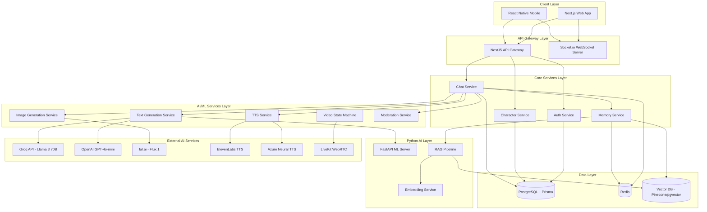
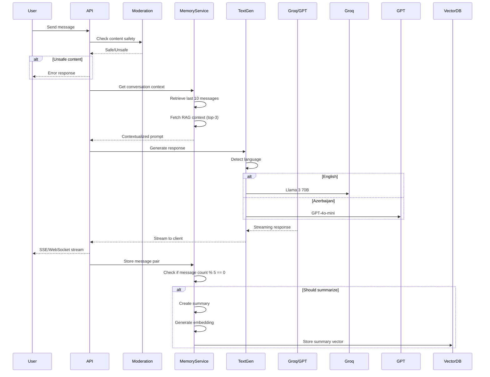
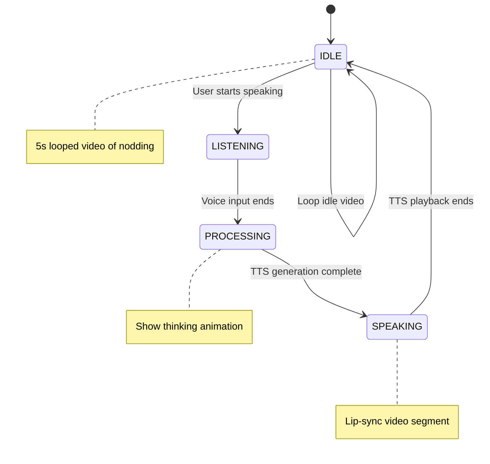

# Ethereal AI Companion Platform - Architecture Overview

## Executive Summary

Ethereal is a headless AI companion platform designed for high-performance, multimodal interactions with support for Azerbaijani language and culture. The system combines cutting-edge AI services with robust backend infrastructure to deliver sub-200ms text responses and immersive multimedia experiences.

## System Architecture



## Technology Stack

### Frontend
- **Web**: Next.js 14+ (App Router), TypeScript, TailwindCSS, Framer Motion
- **Mobile**: React Native (Expo), TypeScript, React Navigation, Reanimated
- **Shared**: tRPC or REST client, WebSocket client, LiveKit React SDK

### Backend - Node.js Services
- **Framework**: NestJS (TypeScript)
- **API Documentation**: Swagger/OpenAPI
- **Real-time**: Socket.io
- **Job Queue**: BullMQ with Redis
- **ORM**: Prisma
- **Validation**: class-validator, class-transformer

### Backend - Python Services
- **Framework**: FastAPI
- **ML**: LangChain, LlamaIndex (RAG)
- **Embeddings**: sentence-transformers
- **Vector**: pinecone-client or pgvector

### Infrastructure
- **Database**: PostgreSQL 15+
- **Cache/Queue**: Redis 7+
- **Containerization**: Docker, Docker Compose
- **Orchestration**: Kubernetes (future)
- **CDN**: CloudFlare (for media delivery)

### AI Services
- **Text**: Groq (Llama 3 70B), OpenAI (GPT-4o-mini)
- **Image**: fal.ai (Flux.1 Dev + LoRA)
- **Voice**: ElevenLabs, Azure Neural TTS, Google Cloud TTS
- **Video**: LiveKit (WebRTC infrastructure)
- **Moderation**: Meta Llama-Guard 2

## Core Modules

### 1. Authentication & User Management
- JWT-based authentication
- OAuth 2.0 social login (Google, Apple)
- Role-based access control (RBAC)
- User profiles with preferences

### 2. Character Management
**Database Schema**:
```typescript
model Character {
  id                String   @id @default(uuid())
  name              String
  description       String
  systemPrompt      String   // Base personality
  voiceId           String?
  loraModelId       String?  // For consistent face generation
  loraTriggerWords  String[] // Flux.1 trigger words
  
  // Personality attributes
  shynessBold       Int      @default(50)  // 0-100 scale
  romanticPragmatic Int      @default(50)
  playfulSerious    Int      @default(50)
  
  // Metadata
  isPublic          Boolean  @default(false)
  isPremium         Boolean  @default(false)
  category          String[]
  tags              String[]
  
  createdBy         String
  createdAt         DateTime @default(now())
  updatedAt         DateTime @updatedAt
  
  // Relations
  conversations     Conversation[]
  media             CharacterMedia[]
}
```

### 3. Conversation & Memory System

#### A. Conversation Flow


#### B. RAG Memory Pipeline
**Strategy**:
1. **Short-term Memory**: Store last 10-20 messages in Redis (fast access)
2. **Long-term Memory**: Every 5 message pairs, create a summary
3. **Embedding**: Use `text-embedding-3-small` or `all-MiniLM-L6-v2`
4. **Retrieval**: Cosine similarity search, retrieve top-3 relevant contexts
5. **Context Window**: Combine short-term + RAG contexts (max 4k tokens)

**Database Schema**:
```typescript
model Message {
  id              String   @id @default(uuid())
  conversationId  String
  role            String   // user | assistant
  content         String
  language        String?  // en | az
  
  // Metadata
  modelUsed       String?
  tokensUsed      Int?
  latencyMs       Int?
  
  createdAt       DateTime @default(now())
  
  conversation    Conversation @relation(fields: [conversationId], references: [id])
}

model MemorySummary {
  id              String   @id @default(uuid())
  conversationId  String
  summary         String
  embedding       Float[]  // Or store in vector DB
  messageRange    String   // e.g., "1-5"
  
  createdAt       DateTime @default(now())
  
  conversation    Conversation @relation(fields: [conversationId], references: [id])
}
```

### 4. Text Generation Service

**Model Routing Logic**:
```typescript
async generateResponse(params: {
  prompt: string;
  conversationId: string;
  characterId: string;
}) {
  // 1. Detect language
  const language = await this.detectLanguage(params.prompt);
  
  // 2. Get character context
  const character = await this.characterService.findOne(params.characterId);
  
  // 3. Get memory context
  const context = await this.memoryService.getContext(params.conversationId);
  
  // 4. Build system prompt
  const systemPrompt = this.buildSystemPrompt(character, context);
  
  // 5. Route to appropriate model
  if (language === 'az') {
    return this.openAIService.generate({
      model: 'gpt-4o-mini',
      systemPrompt,
      userMessage: params.prompt,
      stream: true
    });
  } else {
    return this.groqService.generate({
      model: 'llama3-70b-8192',
      systemPrompt,
      userMessage: params.prompt,
      stream: true
    });
  }
}
```

### 5. Image Generation Service

**Features**:
- Flux.1 Dev model via fal.ai
- LoRA weights for character face consistency
- SFW/NSFW toggle
- Style presets (portrait, full-body, scenario)
- Negative prompts for quality control

**LoRA Management**:
```typescript
model LoRAModel {
  id              String   @id @default(uuid())
  characterId     String
  modelUrl        String   // HuggingFace or custom URL
  triggerWords    String[]
  weight          Float    @default(0.8)
  
  // Training metadata
  trainingImages  String[] // URLs to training set
  trainedAt       DateTime
  
  character       Character @relation(fields: [characterId], references: [id])
}
```

**Image Generation Flow**:
```typescript
async generateImage(params: {
  prompt: string;
  characterId: string;
  style: 'portrait' | 'full-body' | 'scene';
  nsfwAllowed: boolean;
}) {
  // 1. Get character LoRA
  const character = await this.characterService.findOne(params.characterId);
  const lora = await this.loraService.findByCharacter(params.characterId);
  
  // 2. Build enhanced prompt
  const enhancedPrompt = `${lora.triggerWords.join(' ')}, ${params.prompt}`;
  
  // 3. Call fal.ai
  const result = await fal.subscribe('fal-ai/flux-lora', {
    input: {
      prompt: enhancedPrompt,
      image_size: params.style === 'portrait' ? 'square' : 'landscape_16_9',
      num_inference_steps: 28,
      guidance_scale: 3.5,
      loras: [{
        path: lora.modelUrl,
        scale: lora.weight
      }],
      enable_safety_checker: !params.nsfwAllowed
    }
  });
  
  // 4. Store in media table
  await this.mediaService.create({
    url: result.images[0].url,
    type: 'image',
    characterId: params.characterId,
    prompt: enhancedPrompt
  });
  
  return result.images[0];
}
```

### 6. Pseudo-Video Call System

**State Machine Architecture**:


**Implementation Strategy**:
1. **Video Assets**: Pre-generated video loops for each state
   - IDLE: 5-second loop (seamless)
   - SPEAKING: Multiple 2-3 second segments with different expressions
   - TRANSITION: Cross-fade overlay animations

2. **Backend State Management**:
```typescript
enum VideoCallState {
  IDLE = 'idle',
  LISTENING = 'listening',
  PROCESSING = 'processing',
  SPEAKING = 'speaking'
}

class VideoCallService {
  private activeStates = new Map<string, VideoCallState>();
  
  async handleUserSpeechStart(conversationId: string) {
    this.activeStates.set(conversationId, VideoCallState.LISTENING);
    this.emitStateChange(conversationId, VideoCallState.LISTENING);
  }
  
  async handleTTSGeneration(conversationId: string, audioDuration: number) {
    this.activeStates.set(conversationId, VideoCallState.SPEAKING);
    
    // Select appropriate video segment based on duration
    const videoSegment = this.selectVideoSegment(audioDuration);
    
    this.emitStateChange(conversationId, VideoCallState.SPEAKING, {
      videoUrl: videoSegment.url,
      duration: audioDuration
    });
    
    // Schedule return to IDLE
    setTimeout(() => {
      this.activeStates.set(conversationId, VideoCallState.IDLE);
      this.emitStateChange(conversationId, VideoCallState.IDLE);
    }, audioDuration);
  }
}
```

3. **Frontend Video Player** (Next.js/React Native):
```typescript
function VideoCallPlayer({ characterId, conversationId }) {
  const [state, setState] = useState('idle');
  const [videoUrl, setVideoUrl] = useState(idleVideoUrl);
  
  useEffect(() => {
    socket.on(`videoState:${conversationId}`, (data) => {
      setState(data.state);
      
      if (data.state === 'speaking') {
        setVideoUrl(data.videoUrl);
      } else if (data.state === 'idle') {
        setVideoUrl(idleVideoUrl);
      }
    });
  }, [conversationId]);
  
  return (
    <div className="relative">
      <video
        src={videoUrl}
        loop={state === 'idle'}
        autoPlay
        className="w-full h-full"
      />
      {state === 'listening' && (
        <motion.div
          animate={{ scale: [1, 1.2, 1] }}
          transition={{ repeat: Infinity }}
          className="absolute inset-0 border-4 border-blue-500 rounded-full"
        />
      )}
    </div>
  );
}
```

### 7. Text-to-Speech Service

**Multi-Language Strategy**:

| Language | Use Case | Provider | Voice Model |
|----------|----------|----------|-------------|
| Azerbaijani | Native conversations | Azure Neural TTS | `az-AZ-BanuNeural` (Female) or `az-AZ-BabekNeural` (Male) |
| English | High-emotion roleplay | ElevenLabs | Custom trained voices |
| Turkish | Fallback for Azerbaijani | Google Cloud TTS | `tr-TR-Wavenet-A` |

**Implementation**:
```typescript
class TTSService {
  async synthesize(params: {
    text: string;
    language: string;
    characterId: string;
    emotion?: 'neutral' | 'happy' | 'sad' | 'excited';
  }) {
    const character = await this.characterService.findOne(params.characterId);
    
    if (params.language === 'az') {
      // Use Azure for Azerbaijani
      return this.azureTTS.synthesize({
        text: params.text,
        voice: character.voiceId || 'az-AZ-BanuNeural',
        rate: 1.0,
        pitch: 1.0
      });
    } else {
      // Use ElevenLabs for English with emotion control
      return this.elevenLabsTTS.synthesize({
        text: params.text,
        voiceId: character.voiceId,
        stability: 0.5,
        similarityBoost: 0.75,
        style: this.mapEmotionToStyle(params.emotion)
      });
    }
  }
}
```

### 8. Content Moderation System

**Llama-Guard Middleware**:
```typescript
@Injectable()
export class ModerationService {
  async checkContent(content: string): Promise<{
    safe: boolean;
    violations: string[];
  }> {
    const response = await this.llamaGuardAPI.analyze({
      content,
      categories: [
        'violence',
        'sexual_content',
        'hate_speech',
        'self_harm',
        'illegal_activity'
      ]
    });
    
    return {
      safe: response.isSafe,
      violations: response.violatedCategories
    };
  }
}

// Apply as middleware
@Post('chat/send')
@UseGuards(ModerationGuard)
async sendMessage(@Body() dto: SendMessageDto) {
  // Message is already moderated
  return this.chatService.processMessage(dto);
}
```

### 9. Monetization System

**Credit System Schema**:
```typescript
model User {
  id            String   @id @default(uuid())
  email         String   @unique
  credits       Int      @default(100) // Free starting credits
  isPremium     Boolean  @default(false)
  
  transactions  Transaction[]
  subscriptions Subscription[]
}

model Transaction {
  id          String   @id @default(uuid())
  userId      String
  type        String   // earn | spend | purchase | refund
  amount      Int
  balance     Int      // Balance after transaction
  description String
  metadata    Json?
  
  createdAt   DateTime @default(now())
  
  user        User     @relation(fields: [userId], references: [id])
}

enum ActionCost {
  TEXT_MESSAGE = 1,
  IMAGE_GENERATION = 10,
  VOICE_MESSAGE = 3,
  VIDEO_CALL_PER_MINUTE = 20
}
```

**RevenueCat Integration**:
```typescript
@Controller('webhooks/revenuecat')
export class RevenueCatWebhookController {
  @Post()
  async handleWebhook(@Body() payload: any) {
    const event = payload.event;
    
    switch (event.type) {
      case 'INITIAL_PURCHASE':
      case 'RENEWAL':
        await this.subscriptionService.activateSubscription({
          userId: event.app_user_id,
          productId: event.product_id,
          expiresAt: new Date(event.expiration_at_ms)
        });
        break;
        
      case 'CANCELLATION':
        await this.subscriptionService.cancelSubscription({
          userId: event.app_user_id
        });
        break;
        
      case 'UNCANCELLATION':
        await this.subscriptionService.reactivateSubscription({
          userId: event.app_user_id
        });
        break;
    }
  }
}
```

### 10. Discovery Feed API

**Instagram-like Feed**:
```typescript
@Controller('discover')
export class DiscoverController {
  @Get('feed')
  async getFeed(
    @Query('page') page: number = 1,
    @Query('limit') limit: number = 20,
    @Query('category') category?: string
  ) {
    const characters = await this.characterService.findPublic({
      where: {
        isPublic: true,
        ...(category && { category: { has: category } })
      },
      skip: (page - 1) * limit,
      take: limit,
      orderBy: {
        // Ranking algorithm
        _relevance: 'desc'
      }
    });
    
    // Attach preview media
    const enriched = await Promise.all(
      characters.map(async (char) => ({
        ...char,
        previewImages: await this.mediaService.findPreview(char.id, 3),
        stats: await this.statsService.getCharacterStats(char.id)
      }))
    );
    
    return {
      data: enriched,
      pagination: {
        page,
        limit,
        total: await this.characterService.countPublic({ category })
      }
    };
  }
}
```

## API Design Principles

### RESTful Structure
```
POST   /auth/register
POST   /auth/login
POST   /auth/refresh

GET    /characters
POST   /characters
GET    /characters/:id
PATCH  /characters/:id
DELETE /characters/:id

GET    /conversations
POST   /conversations
GET    /conversations/:id
DELETE /conversations/:id

POST   /conversations/:id/messages
GET    /conversations/:id/messages

POST   /generate/image
POST   /generate/voice
GET    /generate/status/:jobId

GET    /discover/feed
GET    /discover/trending
GET    /discover/categories

GET    /user/profile
PATCH  /user/profile
GET    /user/credits
POST   /user/credits/purchase

GET    /subscriptions
POST   /subscriptions/manage-url
```

### Error Handling
```typescript
enum ErrorCode {
  UNAUTHORIZED = 'UNAUTHORIZED',
  INSUFFICIENT_CREDITS = 'INSUFFICIENT_CREDITS',
  CONTENT_VIOLATION = 'CONTENT_VIOLATION',
  RATE_LIMIT_EXCEEDED = 'RATE_LIMIT_EXCEEDED',
  SERVICE_UNAVAILABLE = 'SERVICE_UNAVAILABLE'
}

interface APIError {
  code: ErrorCode;
  message: string;
  details?: any;
  timestamp: string;
}
```

### Streaming Responses
```typescript
// Server-Sent Events for text streaming
@Sse('chat/stream/:conversationId')
async streamMessages(@Param('conversationId') id: string) {
  return this.chatService.streamResponse(id).pipe(
    map(data => ({ data }))
  );
}
```

## Performance Targets

- **Text Response (First Token)**: < 200ms
- **Image Generation**: 3-6 seconds
- **TTS Generation**: < 1 second
- **API Response Time (REST)**: < 100ms
- **WebSocket Latency**: < 50ms
- **Database Query Time**: < 50ms (with proper indexing)

## Security Considerations

1. **API Security**:
   - JWT with short expiration (15min access, 7d refresh)
   - Rate limiting (100 req/min per user)
   - CORS properly configured
   - API key rotation for external services

2. **Data Protection**:
   - Encrypt sensitive data at rest
   - HTTPS/TLS for all communications
   - Sanitize user inputs
   - SQL injection prevention via Prisma

3. **Content Safety**:
   - Llama-Guard on all user inputs
   - NSFW toggle with user consent
   - Age verification for explicit content
   - Report/block functionality

## Next Steps

This architecture provides a solid foundation for building Ethereal. The next phase involves:

1. Setting up the monorepo structure
2. Configuring local development environment with Docker
3. Implementing core services incrementally
4. Testing each module in isolation
5. Integrating AI service providers
6. Building frontend applications

See **[`TECH_STACK_SETUP.md`](TECH_STACK_SETUP.md)** for service selection and API setup guidance.
See **[`PROJECT_STRUCTURE.md`](PROJECT_STRUCTURE.md)** for detailed folder organization.
See **[`IMPLEMENTATION_GUIDE.md`](IMPLEMENTATION_GUIDE.md)** for step-by-step development workflow.
