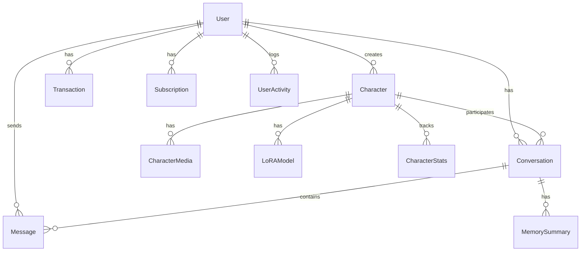

# Database Schema - Ethereal AI Companion Platform

## Overview

Complete Prisma schema for PostgreSQL with pgvector extension for RAG memory.

## Complete Prisma Schema

**File**: [`packages/database/prisma/schema.prisma`](packages/database/prisma/schema.prisma)

```prisma
generator client {
  provider = "prisma-client-js"
  previewFeatures = ["postgresqlExtensions"]
}

datasource db {
  provider = "postgresql"
  url      = env("DATABASE_URL")
  extensions = [vector]
}

// ============================================
// USER MANAGEMENT
// ============================================

model User {
  id            String   @id @default(uuid())
  email         String   @unique
  username      String?  @unique
  passwordHash  String
  
  firstName     String?
  lastName      String?
  avatar        String?
  bio           String?
  
  // Preferences
  language      String   @default("en") // en | az
  timezone      String   @default("Asia/Baku")
  nsfwEnabled   Boolean  @default(false)
  
  // Credits & Subscription
  credits       Int      @default(100)
  isPremium     Boolean  @default(false)
  premiumUntil  DateTime?
  
  // Metadata
  isActive      Boolean  @default(true)
  isVerified    Boolean  @default(false)
  lastLoginAt   DateTime?
  createdAt     DateTime @default(now())
  updatedAt     DateTime @updatedAt
  
  // Relations
  sessions         Session[]
  characters       Character[]
  conversations    Conversation[]
  messages         Message[]
  transactions     Transaction[]
  subscriptions    Subscription[]
  activities       UserActivity[]
  
  @@index([email])
  @@index([username])
}

model Session {
  id           String   @id @default(uuid())
  userId       String
  accessToken  String   @unique
  refreshToken String   @unique
  expiresAt    DateTime
  
  deviceInfo   Json?    // Browser, OS, etc.
  ipAddress    String?
  
  createdAt    DateTime @default(now())
  updatedAt    DateTime @updatedAt
  
  user         User     @relation(fields: [userId], references: [id], onDelete: Cascade)
  
  @@index([userId])
  @@index([accessToken])
}

// ============================================
// CHARACTER SYSTEM
// ============================================

model Character {
  id               String   @id @default(uuid())
  name             String
  displayName      String
  description      String
  systemPrompt     String   @db.Text
  
  // Personality attributes (0-100 scale)
  shynessBold      Int      @default(50)
  romanticPragmatic Int     @default(50)
  playfulSerious   Int      @default(50)
  dominantSubmissive Int    @default(50)
  
  // Voice & Media
  voiceId          String?
  voiceProvider    String?  // elevenlabs | azure | google
  loraModelId      String?
  
  // Discovery
  isPublic         Boolean  @default(false)
  isPremium        Boolean  @default(false)
  category         String[] // romance, friendship, mentor, etc.
  tags             String[]
  
  // Stats
  conversationCount Int     @default(0)
  messageCount     Int      @default(0)
  avgRating        Float?
  
  // Ownership
  createdBy        String
  isOfficial       Boolean  @default(false) // Platform-created
  
  createdAt        DateTime @default(now())
  updatedAt        DateTime @updatedAt
  
  // Relations
  creator          User            @relation(fields: [createdBy], references: [id])
  conversations    Conversation[]
  media            CharacterMedia[]
  loraModels       LoRAModel[]
  stats            CharacterStats[]
  
  @@index([createdBy])
  @@index([isPublic])
  @@index([category])
}

model CharacterMedia {
  id           String   @id @default(uuid())
  characterId  String
  type         String   // profile | gallery | video_idle | video_speaking
  url          String
  thumbnailUrl String?
  
  metadata     Json?    // Width, height, duration, etc.
  order        Int      @default(0)
  
  createdAt    DateTime @default(now())
  
  character    Character @relation(fields: [characterId], references: [id], onDelete: Cascade)
  
  @@index([characterId])
  @@index([type])
}

model LoRAModel {
  id               String   @id @default(uuid())
  characterId      String
  name             String
  modelUrl         String   // HuggingFace or CDN URL
  triggerWords     String[]
  weight           Float    @default(0.8)
  
  // Training metadata
  trainingImages   String[] // URLs to training images
  trainingSteps    Int?
  basedOn          String?  // Base model used
  
  isActive         Boolean  @default(true)
  trainedAt        DateTime?
  createdAt        DateTime @default(now())
  
  character        Character @relation(fields: [characterId], references: [id], onDelete: Cascade)
  
  @@index([characterId])
}

model CharacterStats {
  id              String   @id @default(uuid())
  characterId     String
  date            DateTime @default(now())
  
  conversations   Int      @default(0)
  messages        Int      @default(0)
  imagesGenerated Int      @default(0)
  voiceMessages   Int      @default(0)
  
  character       Character @relation(fields: [characterId], references: [id], onDelete: Cascade)
  
  @@unique([characterId, date])
  @@index([characterId])
  @@index([date])
}

// ============================================
// CONVERSATIONS & MESSAGES
// ============================================

model Conversation {
  id           String   @id @default(uuid())
  userId       String
  characterId  String
  title        String?
  
  // Settings
  language     String   @default("en")
  nsfwEnabled  Boolean  @default(false)
  
  // Stats
  messageCount Int      @default(0)
  lastMessageAt DateTime?
  
  isActive     Boolean  @default(true)
  createdAt    DateTime @default(now())
  updatedAt    DateTime @updatedAt
  
  // Relations
  user         User       @relation(fields: [userId], references: [id], onDelete: Cascade)
  character    Character  @relation(fields: [characterId], references: [id])
  messages     Message[]
  memories     MemorySummary[]
  
  @@index([userId])
  @@index([characterId])
  @@index([lastMessageAt])
}

model Message {
  id              String   @id @default(uuid())
  conversationId  String
  userId          String?
  role            String   // user | assistant | system
  content         String   @db.Text
  
  // Generation metadata
  language        String?
  modelUsed       String?  // groq | openai | etc.
  tokensUsed      Int?
  latencyMs       Int?
  
  // Media attachments
  imageUrl        String?
  audioUrl        String?
  videoUrl        String?
  
  // Flags
  isEdited        Boolean  @default(false)
  isModerated     Boolean  @default(false)
  moderationFlags String[] // If content was flagged
  
  createdAt       DateTime @default(now())
  updatedAt       DateTime @updatedAt
  
  // Relations
  conversation    Conversation @relation(fields: [conversationId], references: [id], onDelete: Cascade)
  user            User?        @relation(fields: [userId], references: [id])
  
  @@index([conversationId])
  @@index([createdAt])
}

model MemorySummary {
  id             String   @id @default(uuid())
  conversationId String
  summary        String   @db.Text
  messageRange   String   // e.g., "msg-123,msg-124,msg-125"
  
  // Vector embedding (if using pgvector)
  // embedding   Unsupported("vector(1536)")?
  
  createdAt      DateTime @default(now())
  
  conversation   Conversation @relation(fields: [conversationId], references: [id], onDelete: Cascade)
  
  @@index([conversationId])
}

// ============================================
// MONETIZATION
// ============================================

enum TransactionType {
  EARN
  SPEND
  PURCHASE
  REFUND
  SUBSCRIPTION
}

model Transaction {
  id          String          @id @default(uuid())
  userId      String
  type        TransactionType
  amount      Int             // Positive for earn, negative for spend
  balance     Int             // Balance after transaction
  
  description String
  metadata    Json?           // Order details, service used, etc.
  
  // For purchases
  paymentMethod String?
  paymentId   String?
  
  createdAt   DateTime        @default(now())
  
  user        User            @relation(fields: [userId], references: [id])
  
  @@index([userId])
  @@index([createdAt])
}

enum SubscriptionStatus {
  ACTIVE
  CANCELLED
  EXPIRED
  PAUSED
}

model Subscription {
  id              String             @id @default(uuid())
  userId          String
  productId       String             // From RevenueCat
  platform        String             // ios | android | web
  status          SubscriptionStatus
  
  currentPeriodStart DateTime
  currentPeriodEnd   DateTime
  
  willRenew       Boolean            @default(true)
  cancelledAt     DateTime?
  
  // RevenueCat metadata
  revenuecatId    String             @unique
  originalPurchaseDate DateTime
  
  createdAt       DateTime           @default(now())
  updatedAt       DateTime           @updatedAt
  
  user            User               @relation(fields: [userId], references: [id])
  
  @@index([userId])
  @@index([status])
}

model CreditPackage {
  id          String   @id @default(uuid())
  name        String
  credits     Int
  price       Float    // USD
  
  platform    String   // ios | android | web
  productId   String   @unique // From app stores
  
  isActive    Boolean  @default(true)
  createdAt   DateTime @default(now())
  
  @@index([platform])
}

// ============================================
// ANALYTICS & MODERATION
// ============================================

model UserActivity {
  id        String   @id @default(uuid())
  userId    String
  action    String   // login | message_sent | image_generated | etc.
  metadata  Json?
  
  createdAt DateTime @default(now())
  
  user      User     @relation(fields: [userId], references: [id])
  
  @@index([userId])
  @@index([action])
  @@index([createdAt])
}

model ModerationLog {
  id             String   @id @default(uuid())
  contentType    String   // message | image | profile
  contentId      String
  
  isViolation    Boolean
  categories     String[] // violence, sexual, hate, etc.
  confidence     Float
  
  action         String?  // blocked | flagged | allowed
  reviewedBy     String?  // admin user id
  
  createdAt      DateTime @default(now())
  
  @@index([contentType, contentId])
  @@index([isViolation])
  @@index([createdAt])
}

// ============================================
// MEDIA GENERATION JOBS
// ============================================

enum JobStatus {
  PENDING
  PROCESSING
  COMPLETED
  FAILED
}

model GenerationJob {
  id           String    @id @default(uuid())
  userId       String
  type         String    // image | voice | video
  
  // Input
  prompt       String?   @db.Text
  characterId  String?
  
  // Output
  resultUrl    String?
  errorMessage String?
  
  // Metadata
  status       JobStatus @default(PENDING)
  provider     String?   // fal | elevenlabs | etc.
  costCredits  Int?
  
  startedAt    DateTime?
  completedAt  DateTime?
  createdAt    DateTime  @default(now())
  
  @@index([userId])
  @@index([status])
  @@index([createdAt])
}
```

---

## Indexes & Performance

### Critical Indexes

```sql
-- User lookups
CREATE INDEX idx_users_email ON "User"(email);
CREATE INDEX idx_users_username ON "User"(username);

-- Character discovery
CREATE INDEX idx_characters_public ON "Character"(is_public) WHERE is_public = true;
CREATE INDEX idx_characters_category ON "Character" USING GIN(category);

-- Message retrieval (most common query)
CREATE INDEX idx_messages_conversation_created ON "Message"(conversation_id, created_at DESC);

-- Analytics time-series
CREATE INDEX idx_user_activity_created ON "UserActivity"(created_at DESC);
CREATE INDEX idx_transactions_created ON "Transaction"(created_at DESC);
```

### Vector Index (pgvector)

If using pgvector for embeddings:

```sql
-- Enable extension
CREATE EXTENSION IF NOT EXISTS vector;

-- Add embedding column
ALTER TABLE "MemorySummary" 
ADD COLUMN embedding vector(1536);

-- Create vector index (IVFFlat for speed, HNSW for accuracy)
CREATE INDEX idx_memory_embedding ON "MemorySummary" 
USING ivfflat (embedding vector_cosine_ops)
WITH (lists = 100);

-- Or use HNSW for better accuracy
CREATE INDEX idx_memory_embedding ON "MemorySummary" 
USING hnsw (embedding vector_cosine_ops)
WITH (m = 16, ef_construction = 64);
```

---

## Seed Data

**File**: [`packages/database/prisma/seed.ts`](packages/database/prisma/seed.ts)

```typescript
import { PrismaClient } from '@prisma/client';
import * as bcrypt from 'bcrypt';

const prisma = new PrismaClient();

async function main() {
  // Create test user
  const testUser = await prisma.user.upsert({
    where: { email: 'test@ethereal.app' },
    update: {},
    create: {
      email: 'test@ethereal.app',
      username: 'testuser',
      passwordHash: await bcrypt.hash('password123', 10),
      firstName: 'Test',
      lastName: 'User',
      credits: 1000,
      isVerified: true,
    },
  });

  console.log('✅ Created test user:', testUser.email);

  // Create official characters
  const characters = [
    {
      name: 'leyla',
      displayName: 'Leyla',
      description: 'A warm and caring Azerbaijani companion who loves poetry and philosophy.',
      systemPrompt: 'You are Leyla, a thoughtful and romantic Azerbaijani woman who enjoys deep conversations about life, love, and culture. You speak both English and Azerbaijani fluently.',
      category: ['romance', 'friendship'],
      tags: ['azerbaijani', 'poetry', 'philosophy'],
      isPublic: true,
      isOfficial: true,
      shynessBold: 40,
      romanticPragmatic: 70,
      playfulSerious: 60,
    },
    {
      name: 'ayla',
      displayName: 'Ayla',
      description: 'An adventurous and energetic companion who loves exploring new ideas.',
      systemPrompt: 'You are Ayla, an enthusiastic and curious person who loves adventure, technology, and trying new things. You are supportive and encouraging.',
      category: ['friendship', 'adventure'],
      tags: ['energetic', 'tech-savvy', 'supportive'],
      isPublic: true,
      isOfficial: true,
      shynessBold: 80,
      romanticPragmatic: 40,
      playfulSerious: 70,
    },
  ];

  for (const char of characters) {
    const character = await prisma.character.upsert({
      where: { id: char.name },
      update: {},
      create: {
        ...char,
        createdBy: testUser.id,
      },
    });

    console.log('✅ Created character:', character.displayName);
  }

  // Create credit packages
  const packages = [
    { name: 'Small Pack', credits: 500, price: 4.99, platform: 'ios', productId: 'com.ethereal.credits.small' },
    { name: 'Medium Pack', credits: 1200, price: 9.99, platform: 'ios', productId: 'com.ethereal.credits.medium' },
    { name: 'Large Pack', credits: 2500, price: 19.99, platform: 'ios', productId: 'com.ethereal.credits.large' },
  ];

  for (const pkg of packages) {
    await prisma.creditPackage.upsert({
      where: { productId: pkg.productId },
      update: {},
      create: pkg,
    });
  }

  console.log('✅ Created credit packages');
}

main()
  .catch((e) => {
    console.error(e);
    process.exit(1);
  })
  .finally(async () => {
    await prisma.$disconnect();
  });
```

---

## Migration Commands

```bash
# Generate Prisma client
npx prisma generate

# Create migration
npx prisma migrate dev --name init

# Apply migrations to production
npx prisma migrate deploy

# Push schema without migration (development)
npx prisma db push

# Seed database
npx prisma db seed

# Reset database (WARNING: deletes all data)
npx prisma migrate reset

# View database in Prisma Studio
npx prisma studio
```

---

## Data Relationships



---

## Query Examples

### Get conversation with messages
```typescript
const conversation = await prisma.conversation.findUnique({
  where: { id: conversationId },
  include: {
    character: true,
    messages: {
      orderBy: { createdAt: 'asc' },
      take: 50,
    },
  },
});
```

### Get user's characters
```typescript
const characters = await prisma.character.findMany({
  where: {
    OR: [
      { createdBy: userId },
      { isPublic: true },
    ],
  },
  include: {
    media: {
      where: { type: 'profile' },
      take: 1,
    },
    _count: {
      select: { conversations: true },
    },
  },
});
```

### Get discovery feed with stats
```typescript
const feed = await prisma.character.findMany({
  where: {
    isPublic: true,
  },
  include: {
    media: {
      where: { type: 'gallery' },
      take: 3,
    },
    creator: {
      select: { username: true, avatar: true },
    },
  },
  orderBy: {
    conversationCount: 'desc',
  },
  take: 20,
  skip: page * 20,
});
```

### Deduct credits atomically
```typescript
const result = await prisma.$transaction(async (tx) => {
  // Check balance
  const user = await tx.user.findUnique({
    where: { id: userId },
  });

  if (user.credits < cost) {
    throw new Error('Insufficient credits');
  }

  // Deduct credits
  const updatedUser = await tx.user.update({
    where: { id: userId },
    data: { credits: { decrement: cost } },
  });

  // Log transaction
  await tx.transaction.create({
    data: {
      userId,
      type: 'SPEND',
      amount: -cost,
      balance: updatedUser.credits,
      description: `Generated ${actionType}`,
    },
  });

  return updatedUser;
});
```

---

## Performance Tips

1. **Use `select` instead of full queries** when you don't need all fields
2. **Paginate with cursor-based** for better performance on large datasets
3. **Use `include` carefully** - each level adds a query
4. **Create composite indexes** for commonly filtered columns
5. **Use `findUnique` over `findFirst`** when possible
6. **Batch operations** with `createMany` / `updateMany`
7. **Use transactions** for atomic operations involving credits

---

## Backup Strategy

```bash
# Automated backups (production)
pg_dump $DATABASE_URL > backup_$(date +%Y%m%d).sql

# Restore from backup
psql $DATABASE_URL < backup_20260405.sql
```

---

This schema provides a robust foundation for the Ethereal platform with room for future extensions.
